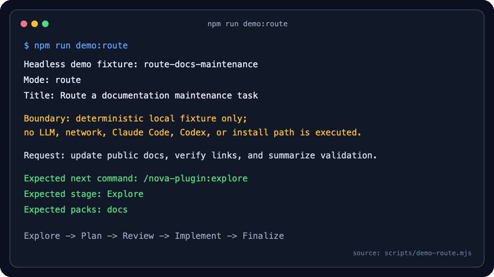

中文 | [English](nova-plugin/docs/overview/README.en.md)

<div align="center">

# LLM Plugins Fusion

**让 Claude Code 按 Explore -> Plan -> Review -> Implement -> Finalize 的工程节奏工作。**

[](https://github.com/lliangcol/llm-plugins-fusion/actions/workflows/ci.yml)
[](https://github.com/lliangcol/llm-plugins-fusion/releases/latest)
[](https://github.com/lliangcol/llm-plugins-fusion/releases/tag/v4.0.0)
[](./LICENSE)

</div>

---

## 解决什么问题

`llm-plugins-fusion` 把临时 prompt 变成可复用、可审查的工程流程。当前主交付物是 `nova-plugin`，围绕五个阶段组织 Claude Code 工作：

```text
Explore -> Plan -> Review -> Implement -> Finalize
```

它适合需要先理解、再计划、审查后实施，并在交付时保留验证与残余风险的人。Marketplace metadata 只是安装与分发机制；本仓库不描述为成熟多插件生态，也不把 deferred public portal 当作已实现能力。



GIF 来自仓库内确定性 `demo:route` fixture，不是 Claude live 行为证据。完整、可复制的输出：

```text
Request: I need to update public docs, verify links, and summarize validation.
Expected next command: /nova-plugin:explore
Expected stage: Explore
Expected packs:
  - docs
```

## 90 秒安装

稳定安装入口以正式 release tag 为准。当前稳定推广基线是 `v4.0.0`；`main` 可能包含 `Unreleased` 后续工作，不能替代 exact release tag 作为稳定发布证据。

```text
/plugin marketplace add lliangcol/llm-plugins-fusion@v4.0.0
/plugin install nova-plugin@llm-plugins-fusion
/nova-plugin:route 这项任务涉及文档、版本和安装验证，请推荐下一步 nova workflow
```

第一次安装后用 `/plugin` 确认插件，再运行只读 `/nova-plugin:route`。没有 Claude Code 时可先执行：

```bash
npm run demo:route
npm run demo:review
```

非 Claude 用户可把 command / skill Markdown 当作契约消费，但不能假设 Claude slash-command runtime 会自动存在。兼容证据见 [Assistant compatibility levels](./docs/reference/compatibility/assistant-levels.md)。

## Security & Trust

- 写入、Bash 和外部 CLI 流程需要明确参数、preflight、artifact 范围和验证证据；不要把全局权限绕过作为默认配置。
- 公开仓库不存放真实 consumer profile、endpoint、凭据、私有仓库地址、业务规则或私有知识库；安全问题按 [SECURITY.md](./SECURITY.md) 私下披露。
- 本地默认质量门是 `node scripts/validate-all.mjs`；Windows 无 Bash 时，Bash-dependent 检查只能报告为 skipped，不能报告为 passed。
- 测试覆盖率证据使用 `npm run test:coverage:check`，它通过 Node 内置 coverage 写入 `.metrics/coverage/`，要求所有受 Git 跟踪、非 `tests/**` 的维护 `.mjs` 都进入覆盖率分母，并执行 lines 85%、branches 70%、functions 90% 的发布阻断门槛；`npm run test:coverage` 保持仅采集模式。
- 固定答案 route smoke 只证明 installation、invocation 与 safety contract；workflow 质量声明必须来自版本化、隐藏标签的 paired evaluation。

## 当前状态

<table>
<tr>
<td><strong>稳定插件版本</strong></td>
<td>4.0.0</td>
</tr>
<tr>
<td><strong>主插件</strong></td>
<td><code>nova-plugin</code></td>
</tr>
<tr>
<td><strong>命令 / Skills</strong></td>
<td>21 个命令，6 个 canonical skills</td>
</tr>
<tr>
<td><strong>Active agents</strong></td>
<td>6 个 core agents，位于 <code>nova-plugin/agents/</code>；8 个 capability packs，位于 <code>nova-plugin/packs/</code></td>
</tr>
<tr>
<td><strong>许可协议</strong></td>
<td>MIT</td>
</tr>
</table>

默认本地质量门是：

```bash
node scripts/validate-all.mjs
```

该入口覆盖 schema、registry fixtures、Claude 兼容性、command / skill frontmatter、canonical workflow 和 adapter 漂移、route 与 workflow-quality eval 数据集、core agent 集合、capability pack 结构、hooks、GitHub workflow 权限、库存和 required-check 合约（包括 action SHA pinning、NPM Test gate 和 Test Coverage evidence）、Codex runtime smoke、surface inventory 漂移、分发风险扫描、核心回归检查、workflow fixture 合约、Markdown 链接和命令文档覆盖。

聚焦入口：`npm run validate:drift` 检查生成漂移，`npm run validate:maintainer` 运行维护者门，`npm run doctor` 诊断本机环境。

## Command Map

新用户和 consumer profile 默认优先使用五个主入口：`/nova-plugin:explore`、`/nova-plugin:produce-plan`、`/nova-plugin:review`、`/nova-plugin:implement-plan`、`/nova-plugin:finalize-work`。不确定下一步时先用只读 `/nova-plugin:route`。其它命令保留为高级/兼容入口，不改变既有行为。

| 阶段 | 目标 | 主入口 | 高级/兼容入口 |
| --- | --- | --- | --- |
| Explore | 选择入口、理解问题、收集事实、暴露不确定性 | `/nova-plugin:route`, `/nova-plugin:explore` | `/nova-plugin:senior-explore`, `/nova-plugin:explore-lite`, `/nova-plugin:explore-review` |
| Plan | 输出实现方案或设计文档 | `/nova-plugin:produce-plan` | `/nova-plugin:plan-lite`, `/nova-plugin:plan-review`, `/nova-plugin:backend-plan` |
| Review | 审查代码、计划或分支风险 | `/nova-plugin:review` | `/nova-plugin:review-lite`, `/nova-plugin:review-only`, `/nova-plugin:review-strict`, `/nova-plugin:codex-review-only`, `/nova-plugin:codex-verify-only` |
| Implement | 按计划实施 | `/nova-plugin:implement-plan` | `/nova-plugin:implement-standard`, `/nova-plugin:implement-lite`, `/nova-plugin:codex-review-fix` |
| Finalize | 交付总结、风险、验证与后续事项 | `/nova-plugin:finalize-work` | `/nova-plugin:finalize-lite` |

Codex 闭环是高级路径，需要 Codex CLI 和 Bash：

```text
/nova-plugin:codex-review-only -> 修复 -> /nova-plugin:codex-verify-only
```

也可以使用半自动闭环：

```text
/nova-plugin:codex-review-fix
```

## What Is Included

```text
llm-plugins-fusion/
|-- .claude-plugin/
|   |-- registry.source.json          # registry 生成输入
|   |-- marketplace.json              # 生成的 Claude marketplace 入口
|   `-- marketplace.metadata.json     # 生成的仓库本地 trust/risk/maintainer/evidence 元数据
|-- nova-plugin/
|   |-- .claude-plugin/plugin.json    # 插件元信息，版本事实源
|   |-- commands/                     # 21 个 slash command 薄入口
|   |-- skills/                       # 6 个 canonical nova-* skills + _shared 策略
|   |-- agents/                       # 6 个 core active agents
|   |-- packs/                        # 8 个 capability pack 文档
|   |-- docs/                         # 用户文档、命令文档和当前架构说明
|   `-- hooks/                        # Claude Code hook 配置和脚本
|-- docs/                             # 仓库文档、consumer 契约、示例、prompt、release 与 marketplace 指南
|   `-- generated/                    # 派生 surface inventory，不手工编辑
|-- fixtures/                         # registry 多 entry fixture
|-- schemas/                          # registry source / marketplace / metadata / plugin schemas
|-- scripts/                          # 本地和 CI 校验脚本
|-- README.md
|-- AGENTS.md
|-- CLAUDE.md
|-- CODE_OF_CONDUCT.md
|-- CONTRIBUTING.md
|-- CHANGELOG.md
|-- ROADMAP.md
`-- SECURITY.md
```

## Documentation

根 README 只保留入口级导航；完整清单由 [docs/README.md](./docs/README.md) 和 [nova-plugin/docs/README.md](./nova-plugin/docs/README.md) 维护。

| 需要 | 入口 |
| --- | --- |
| 快速安装和开始使用 | [Getting Started](docs/getting-started/first-workflow.md) |
| 查看所有仓库级公开文档 | [仓库文档总索引](./docs/README.md) |
| 查看插件文档、命令文档和架构说明 | [nova-plugin 文档索引](./nova-plugin/docs/README.md) |
| 查命令参数、示例和 workflow 模板 | [命令完全参考手册](./nova-plugin/docs/guides/commands-reference-guide.md) |
| 复制命令选择和使用模板 | [命令使用手册](./nova-plugin/docs/guides/claude-code-commands-handbook.md) |
| 接入私有 consumer 项目 | [Consumer profile templates](docs/guides/assistants/README.md) |
| 复用公开安全 workflow 示例 | [Redacted examples](docs/tutorials/README.md) |
| 维护 marketplace metadata | [Registry author workflow](docs/operations/marketplace/registry-authoring.md) |
| 维护仓库检查、CI 和发布 gate | [Maintainer quickstart](docs/operations/maintainers/README.md) |
| 查看公共 API 和兼容边界 | [Public API compatibility](docs/reference/compatibility/public-api.md) |
| 准备发布证据 | [Release evidence template](docs/templates/evidence/release.md) |
| 了解 agent routing 和 capability packs | [Core agent 路由](docs/reference/architecture/agent-routing.md)、[Capability packs](./nova-plugin/packs/README.md) |
| 阅读英文概览 | [English overview](./nova-plugin/docs/overview/README.en.md) |

## Maintenance

先阅读 [CLAUDE.md](./CLAUDE.md) 和 [CONTRIBUTING.md](./CONTRIBUTING.md)。行为修改从 v5/v1 authoring source 与治理元数据开始，v6/v2 IR、Skill 行为块、runtime contract 和 command wrapper 都由生成器维护：

```text
workflow-specs/workflows.json + workflow-specs/behaviors.json
  -> workflows.v6.json + behaviors.v2.json
  -> canonical Skill behavior + runtime contracts
  -> nova-plugin/commands/<id>.md
```

不要直接编辑生成的 marketplace、v6/v2、runtime contract 或 command wrapper。聚合入口是 `npm run llmf -- generate docs|runtime|release|all --write`。

## Quality Gates

```bash
npm ci --ignore-scripts
npm run ci:quick
npm test
npm run test:coverage:check
npm run validate:maintainer
git diff --check
```

默认全量入口仍是 `node scripts/validate-all.mjs`。该入口覆盖 schema、registry fixtures、Claude 兼容性、workflow/adapter 漂移、评测数据、hooks、GitHub workflow 权限、库存和 required-check 合约、runtime smoke、分发风险、回归、fixtures 与文档链接。安装 smoke 默认使用只读 `node scripts/validate-plugin-install.mjs --dry-run`；真实 user-scope 变更只在隔离 CI 或测试用户中显式授权。

## Contributing

提交 PR 前请阅读 [CONTRIBUTING.md](./CONTRIBUTING.md)。安全问题请按 [SECURITY.md](./SECURITY.md) 私下披露。项目路线见 [ROADMAP.md](./ROADMAP.md)。

## License

本项目使用 [MIT License](./LICENSE)。
