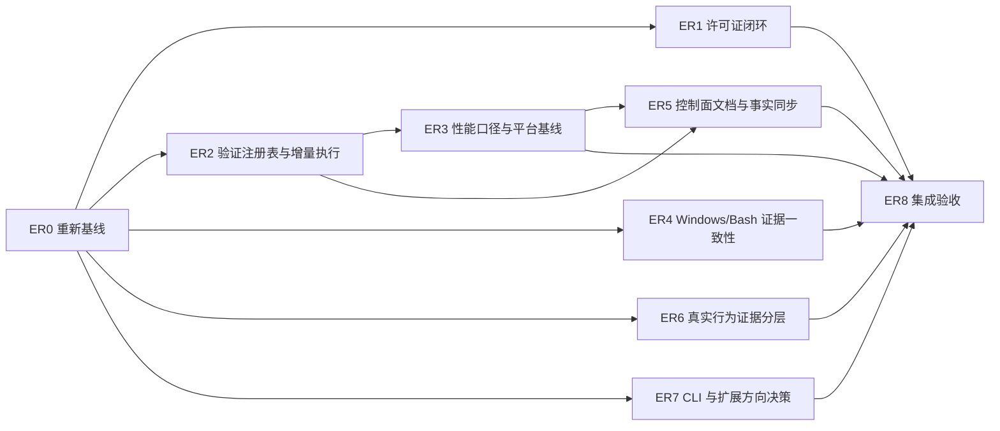

# 深度研究工程风险整改执行计划

Status: implementation-complete-external-evidence-pending

Snapshot date: 2026-07-14

Source report: `deep-research-report.md`, 527 lines, SHA-256
`FE7C10876FE81C93F4CAF6E4AF6DD2C8EBC49C79AB8A587243F50419E92C7F81`

Implementation record: ER0-ER8 local implementation completed on 2026-07-14.
The source-controlled plan remains active because exact-head CI/security lanes,
fresh candidate E3/E4 proof, credentialed live evaluation, and 20 comparable
samples for each governed performance profile are external evidence gates. The
plan must not be marked `completed` or archived until those gates close or an
authorized owner records `rejected-with-reason`.

| Work package | Status | Local result | Remaining boundary |
| --- | --- | --- | --- |
| ER0 | `implemented` | Live ref, toolchain, full gate, demos, install dry-run, and finding ledger captured | Optional CLIs reported separately from deterministic repository checks |
| ER1 | `implemented` | Lockfile SPDX audit, schema, policy reviews, generated evidence/docs, CI, and fixtures | Current 38-package inventory Passed |
| ER2 | `implemented` | Runnable registry, full/incremental/shadow modes, fail-closed selector, opt-in content cache, and tests | CI shadow observation continues; full remains authoritative |
| ER3 | `implemented` | Elapsed/sum split, profile identity, benchmark wrapper, legacy migration, and Not comparable/Blocked semantics | Comparable CI profiles and 20-sample histories are External evidence |
| ER4 | `implemented` | Platform evidence matrix, reason codes, explicit container policy, and Windows Bash runtime lane | Fresh remote platform run is External evidence |
| ER5 | `implemented` | Control-plane map/inventory, generated navigation, and coverage threshold regression | None locally |
| ER6 | `implemented` | E0-E5 taxonomy, E3 stable summary, E4 record binding, no-write/read-only contracts | Fresh exact-candidate E3/E4 and credentialed E5 are External evidence |
| ER7 | `implemented` | ADR 0002 records adopt/experiment/defer/reject decisions | No product lane activated |
| ER8 | `implemented` | Local full/no-cache, tests, coverage, maintainer, install dry-run, runtime, distribution, and diff gates | Required GitHub/security/release evidence remains External evidence |

## 1. 目标与完成口径

本计划把报告中的风险、修复建议、复现步骤、性能基准、竞品借鉴和里程碑
全部转换为可执行工作包。报告是建议输入，不是实时事实源；实施时必须以
最新仓库、生成器、校验器、CI 和外部证据为准。

本计划使用三套互不混用的状态词汇：

- 报告发现 disposition：`confirmed`、`already-closed`、`partial`、
  `strategic-decision`、`preserve` 或 `rejected-with-reason`。
- 工作包状态：`planned`、`in-progress`、`implemented`、`external-evidence`、
  `blocked` 或 `rejected-with-reason`。
- 验证结果：Passed、Skipped、Blocked、Not verified 或 External evidence。

计划生命周期为 `proposed` → `in-progress` →
`implementation-complete-external-evidence-pending` → `completed` → `archived`。
本计划完成不等于发布完成。只有以下条件同时成立，才可关闭工程整改：

1. 每条报告结论都有本节定义的 disposition 和当前证据。
2. 许可证、验证调度、性能、跨平台、文档和行为证据工作包达到各自验收标准。
3. 生成物全部从权威源重建，二次生成无 diff。
4. 聚焦检查、完整仓库门、测试、coverage、drift 和 `git diff --check` 通过；
   Skipped、Blocked、Not verified 和 External evidence 不得写成 Passed。
5. 不把 fixture、dry-run、静态验证或本地能力误写成真实用户安装、真实助手
   调用、稳定发布或外部采用证据。

## 2. 规划快照与实时对账

本计划编写时观察到：

- 本地 `HEAD` 为 `68a2bb354e5789d15558d9dca4040bc5dd0a824a`，当前分支与其
  upstream 一致；本轮未执行远端 fetch，因此实施前必须重新确认远端基线。
- 按仓库规则排除 `.git/`、`.codex/`、`.metrics/`、`.nova/`、依赖、构建输出、
  IDE、缓存、日志和临时/runtime artifacts 后，扫描到 751 个文件。
- 当前 Node 为 v24，Bash 可用；这只证明本机可运行 Bash 门，不代表无 Bash 的
  Windows 环境已经具备等价证据。
- README 当前写明的 coverage 门槛已与代码一致：lines 85%、branches 70%、
  functions 90%。报告中的 branches 60% 漂移已关闭，但仍需加入防回归约束。
- `governance/dependency-policy.json` 已声明 denied licenses；
  `scripts/audit-dependencies.mjs` 仍只处理 `npm audit` 漏洞证据，许可证执行缺口
  仍然成立。
- `scripts/validate-all.mjs` 已并发分组，但仍在入口中手工维护大量
  `nodeTask`/`commandTask`，且以子进程为主。现有 `governance/task-registry.json`
  是维护任务分类表，不是带 inputs、deps 和 cache policy 的可执行验证注册表。
- `scripts/validate-performance-budget.mjs` 仍把任务 duration 求和后与
  `validateAllWallMs` 比较，性能口径问题仍然成立。
- 统一 diagnostics reason code、PowerShell agent verification、Windows Bash CI、
  教程 smoke、isolated install 和 OAuth-authenticated route evidence 已有不同程度
  的实现。相关工作包应先验证和补缺，不得创建第二套平行控制面。
- `packages/cli` 已提供 `llmf` preview CLI；capability packs 的 runtime dynamic
  loading 仍是明确 deferred 的 product lane。报告中的 CLI/扩展建议需要决策，
  不是本轮默认实施授权。

### 2.1 报告结论初始分类

| 报告结论 | 初始状态 | 证据/缺口 | 处理工作包 |
| --- | --- | --- | --- |
| 许可证策略声明但未执行 | `confirmed` | policy 有 deny-list，audit 脚本无 license/SPDX 逻辑 | ER1 |
| `validate-all` 控制面过大、子进程多 | `confirmed` | 入口仍手写大量任务并 spawn 子进程 | ER2 |
| 并发任务求和被称为 wall time | `confirmed` | performance validator 当前直接求和 | ER3 |
| 性能基线只覆盖单一 Windows/Node 组合 | `confirmed` | policy 当前只有一个 platform | ER3 |
| Windows 无 Bash 时信号较弱 | `partial` | reason code 和 CI 已存在，局部本地等价路径仍需分类 | ER4 |
| 用户安装物与维护者控制面边界不清 | `partial` | 新 IA 和 architecture/operations 文档已存在，缺少一页式控制面地图 | ER5 |
| README coverage branches 60% 漂移 | `already-closed` | README 和阈值源当前均为 70% | ER5 防回归 |
| fixture-only demo 不是行为 E2E | `partial` | demo 仍是 fixture；release 侧已有 isolated install 和 live route 设计 | ER6 |
| 借鉴可插拔扩展和 terminal-first 交付 | `strategic-decision` | CLI 已存在；dynamic loading 明确 deferred | ER7 |
| 安全默认拒绝、SHA pin、isolated install 等优势 | `preserve` | 不得因优化调度或 fallback 削弱 | ER0、ER8 |

## 3. 范围、非目标与约束

### 3.1 范围

- 依赖许可证采集、SPDX 判定、机器可读证据、生成文档和 release gate。
- 验证任务注册表、影响面分析、增量选择、内容哈希缓存和全量兼容路径。
- 真实 elapsed、任务求和、关键子路径、历史样本和按平台性能预算。
- Windows/PowerShell/Bash/容器候选路径的证据强度与一致 reason code。
- 用户安装物、运行时护栏、维护者控制面和生成物的架构说明。
- fixture demo、教程 smoke、install dry-run、isolated install、authenticated route、
  live eval 的证据分层。
- 报告竞品建议对应的 CLI、pack extension 和多端入口决策记录。
- 报告给出的复现路径、日志信号、基准方法和里程碑落地。

### 3.2 非目标

- 不修改 `LICENSE` 法律文本；需要法律判断时建立阻断门并交由授权人员确认。
- 不在本轮把 packs 改成动态加载模块，不启动生产 multi-plugin layout 或 public
  portal，不扩张大量领域命令。
- 不把 PowerShell/Node 模拟检查写成 Bash hook 语法或 Bash runtime 已通过。
- 不自动运行会修改日常用户 Claude profile 的 install smoke。
- 不提交原始模型回复、凭据、私有 consumer 信息、本地路径或 `.codex/`、
  `.metrics/`、cache、日志等运行时产物。
- 不在计划阶段 bump 版本、建 tag、发 release、commit 或 push。

### 3.3 不可削弱的现有安全契约

- GitHub 外部 actions 保持 40 位 SHA pin，禁止 `pull_request_target` 和过宽权限。
- 写入、Bash、workspace containment、hard-link、secret redaction 和 audit 继续
  fail closed；任何 bypass 均不能作为 release evidence。
- mutating install smoke 继续要求显式授权和 isolated home。
- 增量/缓存只优化执行，不改变检查语义、失败语义或 release 全量门。
- `nova-plugin` 仍是唯一生产插件；commands 仍是六个 canonical skills 的生成
  wrapper，21/6/6/8 库存不得手工复制或暗中改变。

## 4. 执行依赖图



ER1 和 ER2 可在 ER0 完成后并行；ER4、ER6、ER7 可并行调查。ER3 必须建立在
稳定的调度/报告契约之上。ER8 只在所有本地工作包关闭或明确转为外部门后开始。

## 5. 工作包

### ER0：重新基线、事实台账与复现证据

**目标**

把报告的 2026-07-14 快照与实施时 live repo 对齐，防止修复已经关闭的问题或
依赖陈旧文件名。

**步骤**

1. 读取 `AGENTS.md`、`CLAUDE.md`、`governance/product-lanes.json`、当前活动
   台账和报告；执行带排除规则的 `rg --files -uu` 全树扫描并按质量门分组。
2. fetch 后记录 `HEAD`、upstream、merge-base、工作树、Node/npm/Bash/PowerShell/
   Claude/Codex 能力；不把 optional CLI 缺失写成仓库失败。
3. 为报告每条发现建立唯一台账项，发现 disposition、工作包状态和验证结果分别
   使用本计划第 1 节的词汇，不以其中一类代替另一类。
4. 在修改前执行报告建议的复现路径，但按仓库安全规则把 `npm ci` 收紧为
   `npm ci --ignore-scripts`：

   ```bash
   npm ci --ignore-scripts
   node scripts/doctor.mjs --json
   node scripts/validate-all.mjs --write-timings
   npm run demo:route
   npm run demo:review
   node scripts/validate-plugin-install.mjs --dry-run --isolated-home --json
   ```

5. 保存 public-safe 摘要：命令、ref、状态、reason code、证据路径、跳过原因和
   residual risk；不提交原始 runtime 日志。
6. 把报告的常见错误逐项对到当前接口，不用泛化的“排查失败”代替：

   | 报告信号 | 实施时核对 |
   | --- | --- |
   | Node.js 低于 22 | `.node-version`、`engines.node`、doctor/bootstrap/validate-all 使用同一 reason code 和升级指引；不因报告建议再并列新增 `.nvmrc` |
   | Windows 无 Bash | 转入 ER4，区分本地 Skipped、PowerShell/Node 等价证据和 CI Bash evidence |
   | install smoke 缺少 mutation 接受参数 | ER6 保留 dry-run 与 mutating 模式的互斥 usage/error contract |
   | mutating install 未使用 isolated home | ER6 必须 fail closed，不提供日常用户 profile 回退路径 |
   | maintainer CLI 参数误用 | ER2/ER3 更新 usage、unknown-argument tests 和 wrapper 固定参数，避免任意透传 |

**验收**

- 台账覆盖报告所有章节，且没有以报告描述代替当前代码证据。
- 修改前 full gate 的 Passed/Skipped/Blocked 数量可复查。
- 报告中已关闭项不进入实现 backlog；partial 项只补缺失部分。
- 报告列出的五类日志/错误信号均有当前 reason code、owner 工作包和 remediation。

**回滚**

ER0 只产生计划/证据台账。若基线不可信，停止后续工作并重新采集，不修改业务面。

### ER1：许可证合规执行闭环

**目标**

建立与漏洞审计相互独立的 license audit，真正执行
`dependency-policy.json.deniedLicenses`，覆盖 root、workspaces、直接、传递和
开发依赖。

**建议修改面**

- `governance/dependency-policy.json`
- `schemas/dependency-license-evidence.schema.json`（新增）
- `governance/dependency-license-evidence.json`（新增）
- `scripts/audit-dependency-licenses.mjs`（新增）
- `docs/generated/dependency-license-audit.md`（新增、生成）
- `tests/unit/dependency-license-audit.test.mjs`（新增）
- `fixtures/dependencies/licenses/**`（新增）
- `scripts/validate-all.mjs`、`package.json`、dependency audit workflow、release evidence

**实现步骤**

1. 从 committed `package-lock.json.packages` 建立 canonical inventory。普通包从
   对应 lock entry 读取 license；`link: true` 的 workspace entry 必须沿 `resolved`
   指向 source-controlled workspace lock entry/`package.json`，并校验 name、version
   与链接目标一致。不得只扫描根 `package.json`，也不得用 `npm ls --all --json`
   补 license——当前 npm 输出不提供该字段。lock 与 workspace manifest 都缺失时，
   installed manifest 只能作为诊断线索，不能把 Blocked 升级为 Passed；必须在
   policy 中记录有 owner、依据和 expiry 的人工判定后才能关闭。
2. 使用经过 license/security review、精确锁定且仅用于维护者工具链的
   SPDX parser；不得用字符串包含判断冒充 SPDX 表达式解析。
3. 定义确定性政策：

   | 输入 | 结果 |
   | --- | --- |
   | 单一合法且不在 deny-list 的 SPDX id | Passed |
   | 单一 denied id | Failed / `DENIED_LICENSE` |
   | `AND` 中任一分支 denied | Failed / `DENIED_LICENSE` |
   | `OR` 同时含 allowed 与 denied | Blocked，直到 policy 记录获准选择和 owner |
   | license 缺失、非 SPDX 或无法解析 | Blocked / `LICENSE_METADATA_UNRESOLVED` |
   | `LicenseRef-*` 或自定义文本 | Blocked，要求显式人工审阅记录 |

4. 证据至少记录 lock digest、package name/version/path、direct/transitive、
   workspace/dev/runtime scope、原始 license expression、规范化 AST 摘要、判定、
   reason code、exception/selection owner 和 expiry；输出不得包含本地绝对路径。
5. 在 `validate-all` 中新增独立 `security.license-audit`，不要把 license 结果塞进
   `security.dependency-audit` 的漏洞计数。
6. README/architecture/release evidence 明确漏洞审计与许可证审计是两条证据链。
7. 兼容一个 minor 的旧 vulnerability evidence 字段，但 release gate 不提供
   `NOVA_LICENSE_AUDIT_LEGACY=1` 一类 fail-open 绕过。回滚使用 git revert 和
   已发布 schema 兼容读取，不复制一套长期 legacy validator。

**测试矩阵**

- `MIT`、`Apache-2.0`、`BSD-2-Clause`、`BSD-3-Clause` 通过；deny-list 中的
  GPL/AGPL exact SPDX id 与组合表达式阻断。
- `MIT AND GPL-3.0-only` 失败；`MIT OR GPL-3.0-only` 进入人工选择门。
- 缺失、数组、deprecated id、`WITH` exception、嵌套 AND/OR、LicenseRef。
- 同名多版本、`link: true` workspace package、optional/dev/transitive dependency。
- deny-list 或 exception 变化使 evidence drift；过期 exception 失败。
- lockfile 改变但 evidence 未更新时失败。

**验收**

- `validate-all` 独立展示 vulnerability 与 license 两项状态。
- 当前 lockfile 的许可证证据可重复生成，二次生成无 diff。
- denied、缺失和不可解析许可证不能以 clean 结果通过。
- 分发插件仍无新增 Node runtime dependency；SPDX parser 只属于 maintainer toolchain。

### ER2：验证控制面解耦、影响面分析与安全缓存

**目标**

把 `validate-all` 从手写任务清单迁移为可审查的执行注册表，在保持默认 full 语义
和 release 全量门的前提下提供增量执行。

**权威模型与修改面**

`scripts/lib/validation-task-registry.mjs` 是 runnable validation task 的唯一权威源，
同时导出纯 metadata 和 runner factory。`scripts/validate-all.mjs` 只保留参数解析、
环境探测、选择/调度、汇总和退出码。现有 `governance/task-registry.json` 继续拥有
全仓维护任务的分类规则；`generate-task-catalog` 从 runnable registry 的 runner
路径套用该分类，而不是再复制 task id、inputs 或 deps。建议同时新增针对 registry、
selector 和 cache 的 unit/integration fixtures，不新增第二份 JSON impact map。

每个 validation task 至少声明：

```text
id, label, runner, args, inputs, outputs, deps, platforms,
networkPolicy, mutationPolicy, cachePolicy, timeoutMs, reasonCodes
```

**实施步骤**

1. **等价抽取**：先把当前三组任务和依赖抽入 registry，不加入选择或缓存；
   full 模式输出、顺序约束、超时、状态和退出码与旧入口保持一致。
2. **影响面分析**：实现：

   ```text
   node scripts/validate-all.mjs --full
   node scripts/validate-all.mjs --changed-since <rev>
   node scripts/validate-all.mjs --files <repo-relative path-or-glob...>
   node scripts/validate-all.mjs --explain
   ```

   `--full` 仍是无参数默认值。`--changed-since` 与 `--files` 互斥；glob 由 Node
   解析，不依赖 shell expansion。
3. **fail-closed 选择**：未知文件、未匹配文件、registry/schema/shared runner/
   package-lock/Node baseline 变化触发 full；删除、rename、untracked 和生成源变化
   必须进入影响计算。task dependency 做传递闭包。
4. **shadow mode**：在一段 CI 观察期同时计算 incremental 选择集和 full 结果，
   比较是否漏掉失败；观察期内 incremental 不替代 required full check。
5. **内容哈希缓存**：key 包含 task definition、所有 inputs、依赖结果 digest、
   Node major、platform/arch、影响语义的环境变量和命令 argv。cache entry 另存
   Passed 状态及预期 output digest；命中时必须确认所有 outputs 存在且当前 digest
   与 entry 一致，否则按 miss 重跑。不得把当前 output digest 混入 key 后直接把
   一个被手工修改的生成物视为新的有效缓存。只缓存 Passed，不缓存
   Skipped/Blocked/Failed。
6. cache 初始只允许 deterministic、network-free、side-effect-free allowlist。
   install、live assistant、release identity、freshness/network audit 和计时采样默认
   `cachePolicy=never`。缓存目录为 ignored `.cache/nova-validate/`。
7. CI 策略分层：PR 可新增 incremental quick signal，但 authoritative full check
   保留到 shadow evidence 证明 selector 无漏检；nightly、candidate、promotion、
   release 和 maintainer gate 始终使用 `--full --no-cache`，参数由 wrapper 固定传递，
   不开放任意 argv passthrough。

**验收测试**

- README-only、workflow-only、schema-only、hook-only、dependency-only、shared-lib、
  删除/rename、未知文件和全局配置变更的 task selection golden cases。
- 每个 task 至少一个 input mutation 能触发它；对每个 selector rule 做反向突变，
  证明漏选会被测试捕获。
- `--full` 与重构前同一 ref 的 task ids、状态和失败结果等价。
- cache hit 前后输出语义一致；输出被删/改、Node major 或 policy 改变时 cache 失效。
- docs-only 场景在同机 20 次样本中，task 数至少减少 50%，warm p50 elapsed 至少
  降低 30%；若无收益或发现漏检，缓存保持 opt-in。

**兼容与回滚**

不新增长期 `validate-all-legacy.mjs`，避免两个质量门漂移。`--full --no-cache` 是
兼容/止损路径；在一个 minor 内保留旧 diagnostics 字段读取，异常时关闭
incremental/cache 并回退 registry 提交。

### ER3：真实性能口径、历史样本与平台预算

**目标**

让性能预算区分端到端墙钟、任务求和和关键子路径，避免并发重复计时误导。

**建议修改面**

- `scripts/validate-all.mjs`、diagnostics schema
- `scripts/validate-performance-budget.mjs`
- `scripts/profile-validation.mjs`
- `scripts/validate-maintainer.mjs`、performance CI step
- `governance/validation-performance.json` 及其 schema/tests

**实施步骤**

1. 在 `validate-all` 入口记录 monotonic start/end，在 diagnostics summary 输出：

   ```json
   {
     "elapsedWallMs": 0,
     "sumTaskMs": 0,
     "runtimeSmokeMs": 0,
     "selectedTaskCount": 0,
     "cacheHitCount": 0,
     "mode": "full"
   }
   ```

2. `elapsedWallMs` 是唯一可与总墙钟预算比较的字段；`sumTaskMs` 只用于热点分析。
   并行执行时正常满足 `elapsedWallMs <= sumTaskMs + orchestrationOverhead`，不得把
   sum 重命名为 wall。
3. 解决自验证循环：`validate-all` 内部任务改为 `performance.policy`，只校验
   policy/schema，不能产出“本次 observed budget Passed”。扩展
   `profile-validation.mjs --benchmark` 作为权威 wrapper：无 CPU profiler 地运行
   `validate-all --full --no-cache`，写入 diagnostics/timings，待子进程结束后再调用
   performance validator，单独产出 `performance.observed`。旧
   `performance.budget` task id 只保留一个 minor 的 diagnostics 读取映射，不再作为
   新结果 id。maintainer gate 和 performance CI 使用此 wrapper。现有 CPU profile
   模式继续只作热点诊断，并在输出中标 `comparable=false`，不得进入墙钟基线。
4. diagnostics/schema 升级一个版本；一个 minor 内同时输出 deprecated 旧字段和
   新字段，并提供明确迁移错误，不静默误读旧报告。
5. 把 `governance/validation-performance.json` 升级为按实际收集的
   `platform-arch-nodeMajor-runnerClass-concurrency-scenario` profile 管理预算，同时
   绑定 validation registry/policy digest。报告建议的 Windows、Linux、macOS/Node 22
   组合必须先由 CI 真实采样，不预填虚构阈值；本机与 CI runner class 未知或不同
   时不得直接比较。未知本机 profile 输出 Not comparable，不能升级性能声明，但
   不使其他确定性 maintainer checks 失败；required CI/release 使用显式
   `--require-profile`，缺失或不匹配时为 Blocked 并以非零退出。
6. 场景使用可复现定义：`fresh-process-full-uncached` 表示新 Node 进程、full、
   validation cache 为空，但不声称操作系统磁盘缓存为 cold；
   `full-cache-warm` 与 `incremental-cache-warm` 使用固定的预热步骤和输入变更集。
   runtime smoke、docs、GitHub workflows、dependency/license audit 单独记录。报告中的
   “cold full”在证据里映射为前述 fresh-process 场景，并附 OS/cache 限制。
7. 最近 20 次绿色、同完整 profile、同 scenario 的 CI diagnostics 作为 artifact 聚合；
   动态历史不直接提交。达到 20 个可比样本后生成 p50/p95；不足 20 时只报告
   median、range 和样本数，不把小样本 P95 当稳定基线。
8. 预算调整必须有 before/after 样本、原因、owner 和回归风险；单次慢运行不自动
   放宽 policy。

**验收**

- 并发与串行 fixture 能证明 elapsed 和 sum 的区别。
- benchmark wrapper 只在 `validate-all` 子进程结束后校验 observed elapsed；CPU
  profile 产物会被拒绝为 comparable evidence。
- 当前 `validateAllWallMs` 的错误命名被迁移，sum 不再阻断 elapsed budget。
- 不同 platform、arch、Node major、runner class 或 concurrency 的报告不能互相
  冒充；未知本机 profile 为 Not comparable，required CI/release profile 缺失为
  Blocked。
- full 与 incremental 分开比较，cache hit 不污染 cold baseline。

**回滚**

保留一个 minor 的双字段输出；如新预算不稳定，只关闭预算 enforcement，不删除
原始 elapsed 采集，并继续把状态写为 non-comparable 而非 Passed。

### ER4：Windows、PowerShell 与 Bash 证据一致性

**目标**

增加无 Bash Windows 上可获得的确定性证据，同时不伪造 Bash runtime 等价性。

**分级矩阵**

| 检查类型 | 无 Bash Windows 路径 | 证据语义 |
| --- | --- | --- |
| Agent inventory | `scripts/verify-agents.ps1` | 与 Bash 版本等价，通过 shared fixtures 证明 |
| Node schema/docs/registry validators | 直接 Node | 跨平台 authoritative |
| Bash hook syntax | 无 PowerShell 等价；使用 Windows Bash CI/Linux | 本地 Skipped，CI Passed 才能关闭 |
| Bash launcher/runtime behavior | 复用 Node payload 测试 + Windows Bash CI | Node 只证明 payload；不能证明 launcher |
| 可容器化的独立 Bash smoke | 显式 `--container-fallback` 候选 | 仅在 pinned image、固定 argv、无用户 profile 变更时有效 |

**实施步骤**

1. 盘点所有 Bash-dependent tasks，给出 `native-node`、`powershell-equivalent`、
   `container-candidate` 或 `bash-authoritative` 分类。
2. 复用 `governance/diagnostic-reasons.json`，新增所需的 fallback/evidence-strength
   reason code；doctor、bootstrap、validate-all 文本和 JSON 使用相同状态。
3. PowerShell/Bash 等价检查共享一套 golden fixtures，避免两个实现只比较输出文案。
4. Docker 不做自动 fallback：只有显式 flag、已安装 runtime、pinned image digest、
   只读 mount、禁网和固定 argv 全部成立时才运行；不可用时给 remediation hint。
5. CI 保留 Linux、Windows Node/PowerShell、Windows Bash 和 macOS lanes；平台模拟
   单测不能替代至少一次真实 runner 证据。

**验收**

- 四类平台/能力 fixtures 的 status、reasonCode、skippedReason 一致。
- 无 Bash Windows 仍能完成所有 Node 与 PowerShell 等价门。
- Bash syntax/launcher 未运行时始终为 Skipped/External evidence，不出现 Passed。
- 文档给出 Git Bash/WSL/CI/容器候选路径及各自证据强度。

### ER5：控制面边界、生成式清单与事实防漂移

**目标**

让贡献者在一页内区分用户安装物、runtime guardrails、maintainer control plane、
generated projections 和 external evidence，并把易漂移事实接回权威源。

**建议修改面**

- `docs/reference/architecture/control-plane.md`（新增）
- `scripts/generate-control-plane-inventory.mjs`（新增）
- `docs/generated/control-plane-inventory.json` / `.md`（新增）
- `governance/doc-metadata.json`、`docs/README.md`
- `scripts/sync-doc-facts.mjs`、project-state/fact graph 与 docs regression tests

**实施步骤**

1. 先审查现有 framework、skill-first projection、maintainer validation、task catalog
   和 release docs；新文档只补横向地图，不复制叶子文档。
2. 清单从 package scripts、runnable validation registry、GitHub workflows、
   governance sources、generators 和 public artifact boundary 生成，记录 owner、输入、
   输出、是否 generated、运行时/维护者范围和质量门。
3. version、21/6/6/8 inventory、workflow schema、coverage threshold、stable channel
   等当前事实从权威 JSON/JS 生成或同步；不在 Markdown 维护第二份数字源。
4. 把 README branches 70% 的当前修复加入 negative regression，证明回改为 60%
   会被 `validate-docs`/regression 捕获。
5. 更新 documentation navigation 和 metadata；生成器二次运行必须无 diff。

**验收**

- 新贡献者能从一页定位：什么进入 `nova-plugin` archive、什么只在 maintainer
  toolchain、什么是 generated、什么需要外部 GitHub/assistant 证据。
- 修改 coverage/version/inventory 权威源会更新或阻断所有当前文档引用。
- 新清单不会把 deferred portal、多插件或 dynamic loading 描述为现状。

### ER6：真实行为样本与证据分层

**目标**

补齐 fixture demo 与真实安装/调用之间的证据链，同时复用现有 release candidate、
isolated install 和 authenticated route 能力。

**证据等级**

| 等级 | 示例 | 能证明 | 不能证明 |
| --- | --- | --- | --- |
| E0 Static | schemas、docs、contract validation | 结构与漂移 | CLI 可安装或模型行为 |
| E1 Fixture | `demo:route`、`demo:review` | 教学输出与确定性渲染 | LLM/网络/安装 |
| E2 Local smoke | tutorial smoke、install dry-run | 本地脚本和计划路径 | 用户范围安装或认证调用 |
| E3 Isolated install | temp HOME 安装/更新/inventory | exact artifact 可安装且内容匹配 | 模型遵循 workflow |
| E4 Authenticated route | isolated read-only `/nova-plugin:route` | 安装后真实 CLI/assistant route 行为 | 全工作流质量或广泛采用 |
| E5 Live evaluation | versioned multi-case/attempt evidence | 指定 assistant/version 的行为统计 | 其他版本、用户项目或生产结果 |

**实施步骤**

1. 对账现有 candidate workflow、stable install proof、route evidence schema 和 release
   summary；存在的能力只补 freshness、测试和导航，不另建第二套 runner。
2. 为 E3/E4 定义或复用 public-safe JSON record，绑定 tag/commit、artifact/tree
   digest、assistant version、tool allow/deny policy、before/after workspace digest、
   状态和 reason code。每次运行的 record/log 保留在 candidate/control bundle 或 CI
   artifact，不随普通 CI 提交进仓库；source-controlled Markdown 只能从已接受的
   governed stable proof 生成，不能追随“最近一次运行”。日志不包含 token、原始
   model response、prompt 或本地绝对路径。
3. E4 只允许 read-only route surface；Write/Edit/NotebookEdit/Bash 明确 denied，
   临时 HOME/XDG/Claude config 完全隔离并清理。
4. credentialed workflow 仅 manual/scheduled 或 exact candidate gate，不加入普通 PR；
   缺少 credential/rate limit/外部服务时为 External evidence。
5. docs 和 release evidence 明确展示当前最高证据等级，禁止 E1/E2 升级兼容声明。

**验收**

- fixture 与真实 smoke 在命名、schema、报告和 release gate 中不会混淆。
- 一次 E3/E4 失败会阻断对应 candidate/promotion，而不是生成 clean summary。
- public artifact 通过 secret/distribution scan，且原始响应不进入仓库或 CI artifact。
- 若当前实现已经满足某项，ER6 以 fresh proof 和 regression 关闭，而非重写实现。

### ER7：竞品建议、CLI 与扩展方向决策

**目标**

覆盖报告的 Continue、Cline、Roo Code、Codex CLI 对比与借鉴，但把不稳定外部事实
和产品扩张从工程缺陷整改中隔离。

**实施步骤**

1. 在决策时只使用各项目官方仓库/文档重新核对维护状态、许可、CLI、SDK、MCP、
   plugin 和 multi-agent 能力；报告中的外部状态不直接视为当前事实。
2. 评估现有 `packages/cli`/`llmf`：安装方式、是否仅 private workspace、可支持的
   preview/validate/build 命令、与 Claude marketplace 的边界、二进制分发成本和
   terminal-first 用户需求。不得再创建同名平行 CLI。
3. 评估 capability pack 注册接口，但保持 `runtime-dynamic-loading` deferred，除非
   有重复外部需求、owner、threat model、版本兼容和 rollback 证据。
4. 把多端入口、多语言文档、角色化 UX、SDK 化和独立 CLI 分发分别判为
   `adopt`、`experiment`、`defer` 或 `reject`，记录依据和激活条件。
5. 输出独立 ADR，例如
   `docs/project/decisions/0002-cli-and-extension-direction.md`。若决定激活 product
   lane，另建实施计划；不得夹带进本轮安全/性能 PR。

**验收**

- 报告每条竞品借鉴都有明确 disposition。
- ADR 承认当前已有 `llmf` 和 deferred lanes，不把对比建议写成现有能力。
- 未经产品 lane 激活，不修改 production plugin layout、pack runtime 或发布渠道。

### ER8：集成、回归、发布边界与最终收口

**目标**

以小批次集成所有工作包，证明优化没有削弱安全、质量门和生成契约。

**建议验收单元**

1. License schema/policy/fixtures/parser/evidence/generator。
2. Validation registry 等价抽取。
3. Incremental selector shadow mode。
4. Cache allowlist 与失效语义。
5. Diagnostics/performance schema、采集和平台 profile。
6. Windows/Bash fallback 分类和 CI fixtures。
7. Control-plane 文档、生成清单和事实同步。
8. Real behavior evidence taxonomy/fresh proof。
9. Strategic ADR；不与实现代码混合。

每个单元都记录：变更范围、权威源、generated outputs、聚焦命令、Observed Passed、
Skipped/Blocked/External evidence、残余风险和回滚点。一个单元未关闭时，只有与其
无依赖的单元可以继续。

## 6. 里程碑、工时与并行策略

报告中的绝对日期不在缺少 owner/capacity 的情况下沿用。本计划转换为依赖驱动
里程碑；工时为工程人日，不含等待外部 CI、凭据、法律或 20 次样本窗口的日历时间。

| 里程碑 | 工作包 | 主要交付 | 估算 | 可并行 |
| --- | --- | --- | --- | --- |
| M0 | ER0 | 实时基线、覆盖台账、修改前证据 | 0.5–1 | 否 |
| M1 | ER1 | License audit、evidence、docs、gate | 3–4 | 与 M2 并行 |
| M2 | ER2 | Runnable registry、selector、shadow、cache | 5–7 | 与 M1/ER4 调查并行 |
| M3 | ER3 | elapsed/sum/runtime、历史样本、平台预算 | 2–3 | ER2 抽取后开始 |
| M4 | ER4 | Windows/Bash 分类、reason code、CI 证据 | 2–3 | 可与 M1 并行 |
| M5 | ER5 | Control-plane map、生成清单、事实防漂移 | 1.5–2 | ER2/ER3 schema 稳定后 |
| M6 | ER6 | 行为证据分层、fresh isolated proof | 1.5–2.5 | 可与 M3/ER5 并行 |
| M7 | ER7 | CLI/extension ADR | 1–2 | ER0 后独立 |
| M8 | ER8 | 全量回归、review-fix、交付台账 | 1.5–2.5 | 否 |

串行工程量约 18–27 人日；复用已实现的 diagnostics、CI、install/route evidence 后，
预计可减少 2–4 人日。ER3 的 20 次样本和 ER6 credentialed proof 是日历型外部门，
不得通过增加本地代码来伪造完成。

## 7. 验证矩阵

### 7.1 每单元聚焦门

| 变更面 | 最低检查 |
| --- | --- |
| License policy/schema/evidence | license unit fixtures、`validate-schemas`、dependency audit、generated drift |
| Validation registry/selector/cache | unit + integration + regression、full parity、mutation selection matrix |
| Performance schema/budget | performance unit fixtures、diagnostics schema、serial/concurrent cases |
| Windows/Bash | Node unit、PowerShell agent verification、Bash syntax/runtime smoke、GitHub workflow validation |
| Docs/control-plane | generators、`validate-docs`、doc governance、regression、二次生成无 diff |
| Install/route evidence | install dry-run、isolated exact-artifact smoke、schema、secret/distribution scan |
| ADR only | docs validation、product-lane contract、`git diff --check` |

### 7.2 最终本地门

实施后的最终本地验收至少包括：

```bash
npm ci --ignore-scripts
npm run test:coverage:check
npm run validate:maintainer
node scripts/validate-plugin-install.mjs --dry-run --isolated-home --json
npm run demo:route
npm run demo:review
node scripts/scan-distribution-risk.mjs
git diff --check
```

ER3 完成后，`validate:maintainer` 内部必须通过 benchmark wrapper 仅运行一次
`validate-all --full --no-cache`，并在子进程结束后校验 observed performance；它还
负责 unit/integration/e2e、generated registry drift、working-tree 与 staged diff。
因此本节不再在 wrapper 前后重复列出 `npm test`、`validate-all` 或
`validate:drift`。coverage 保持独立，因为它是单独的发布门。未知本机 performance
profile 必须显式报告 Not comparable；最终 release/计划完成仍要求目标 CI profile
以 `--require-profile` 通过，不能把本地非可比结果算作性能证据。

当 Bash 实际可用时另跑：

```bash
bash -n nova-plugin/hooks/scripts/pre-write-check.sh
bash -n nova-plugin/hooks/scripts/pre-bash-check.sh
bash -n nova-plugin/hooks/scripts/trusted-node-hook.sh
bash -n nova-plugin/hooks/scripts/post-audit-log.sh
node scripts/validate-runtime-smoke.mjs
```

Windows 另跑：

```powershell
.\scripts\verify-agents.ps1
```

命令名称若在 ER2 重构中变化，必须保留兼容入口或同步本节、CLAUDE、AGENTS、
package scripts、CI 和 release runbook。

### 7.3 外部门

- PR required checks、CodeQL、Dependency Review 和平台矩阵结果。
- manual/scheduled 或 exact-RC isolated install 与 authenticated route evidence。
- 许可证人工选择/例外的 owner 与 expiry。
- 20 次可比性能样本窗口。
- 若激活 CLI/extension product lane，独立产品评审和维护 owner。

这些门未完成时，代码工作包可以标为 `implemented`，相关证据工作包标为
`external-evidence`，计划生命周期最多进入
`implementation-complete-external-evidence-pending`，不得标为 `completed`。

## 8. 风险、止损与回滚

| 风险 | 早期信号 | 止损/回滚 |
| --- | --- | --- |
| SPDX 误判或 license metadata 不完整 | 大量 unresolved、OR/LicenseRef 争议 | fail closed，保留人工选择记录；回退 enforcement，不伪造 Passed |
| Incremental selector 漏检 | shadow full 出现 incremental 未选择的失败 | 立即禁用增量 required check，保持 full，修复 impact map |
| Cache 掩盖失败 | 清理 cache 后结果不同 | cache 保持 opt-in；只缓存 Passed；扩大 fingerprint 或移除 task allowlist |
| 性能预算波动 | 同 profile 样本方差过大 | 不放宽门；分离 cold/warm，增加样本并标 non-comparable |
| PowerShell 被误当 Bash 证据 | 本地显示 Passed 但 launcher 未运行 | 拆分 task id/status；Bash-only 项回到 Skipped/CI evidence |
| 文档生成面重复 | 两个清单拥有不同 owner/count | 删除平行源，回到 project-state/registry/task source 生成 |
| Live evidence 泄密或污染 workspace | artifact 含原始响应/路径，before/after digest 变化 | 失败并删除 artifact，轮换相关 secret，保留只含摘要的失败 reason |
| 竞品建议造成 scope creep | PR 开始改 pack runtime/production layout | 停止实现，先完成 ER7 ADR 与 product-lane 激活 |

各工作包必须可独立 revert。不得以降低 fail-closed 策略、扩大 permissions、关闭
secret scan、删除 full gate 或伪造历史证据作为回滚方案。

## 9. 报告全量覆盖矩阵

| 报告章节 | 本计划覆盖 | 预期产出 |
| --- | --- | --- |
| 执行摘要 | 1、2、5、6 | 优先顺序、状态分类、里程碑 |
| 研究范围与方法 | ER0 | live repo 重新基线与证据边界 |
| 代码结构与关键组件 | ER0、ER5 | 保留架构契约、生成 control-plane inventory |
| 功能缺陷与契约问题 | ER5、ER6 | 文档边界、防漂移、证据等级 |
| 安全、依赖与许可证风险 | ER1、3.3、ER8 | License gate 且保留现有安全壳 |
| 依赖树与风险表 | ER1 | 全 lockfile inventory 和 machine-readable evidence |
| 性能瓶颈 | ER2、ER3 | registry/incremental/cache、真实性能口径 |
| 可维护性与可扩展性 | ER2、ER5、ER7 | 可执行注册表、单一事实源、产品决策 |
| 高优先级方案 | ER1、ER2 | 许可证闭环、验证解耦 |
| 中优先级方案 | ER3、ER4、ER5 | 性能、Windows/Bash、控制面文档 |
| 低优先级方案 | ER6 | fixture 与真实行为证据链 |
| 复现路径 | ER0、7 | 安全化复现命令和 observed evidence |
| 常见错误与日志 | ER0、ER4 | reason code、remediation、skip 语义 |
| 性能基准建议 | ER3 | 三层指标、两类以上场景、历史样本 |
| 同类项目对比 | ER7 | 官方来源复核和 ADR disposition |
| 里程碑与甘特建议 | 4、6 | 依赖图、波次、工时和并行策略 |
| 最终优先级清单 | 5、6 | ER1/ER2 优先，ER3/4/5/6 后续，ER7 决策隔离 |

## 10. Definition of Done

本计划只有在以下事项均有证据时才能进入 `completed`：

- 每条报告发现都有 disposition；ER0–ER8 全部为 `implemented` 或
  `rejected-with-reason`，且 rejection 有授权 owner、依据和替代控制。
- 不存在 `blocked` 或 required `external-evidence`。只有经授权判定为非适用的外部门
  才能以 `rejected-with-reason` 关闭，不能用“等待外部证据”替代完成。
- License audit 对 denied/missing/unparseable 输入 fail closed，当前 lockfile 证据新鲜。
- Full validation 保持权威；incremental/cache 经过 shadow parity 和漏检测试。
- Performance budget 使用真实 elapsed，按平台和场景比较。
- Windows fallback 不混淆 Bash launcher 证据。
- Control-plane 文档和 inventory 从权威源生成，coverage 70% 分支门有防漂移回归。
- Fixture、install、route 和 live eval 证据等级可区分，release summary 不越级声明。
- 竞品建议有 ADR disposition，deferred product lanes 未被暗中激活。
- 最终 full/no-cache 门、tests、coverage、drift、docs、runtime、distribution 和 diff
  检查通过；所有 skip/external gates 明确列出。

完成后，将仍有效的行动和证据合并到
[`current-remediation.md`](current-remediation.md) 的唯一活动台账；本文件转为
historical/archived，避免长期存在两个互相漂移的活动整改源。
