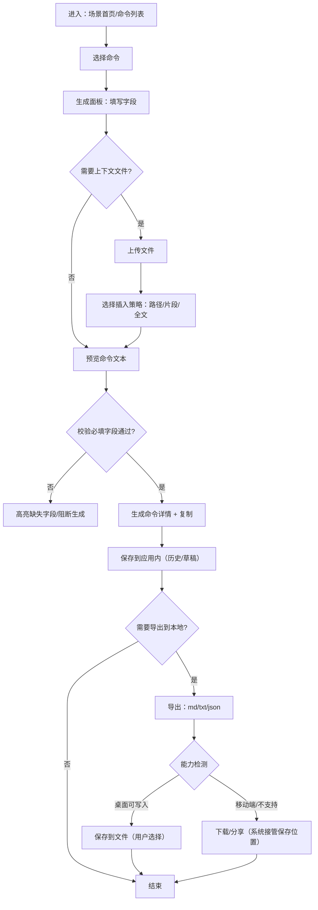
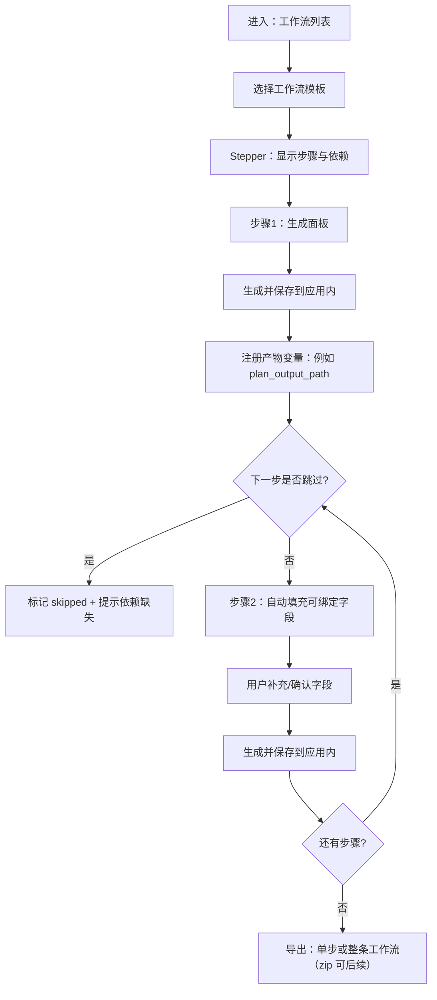
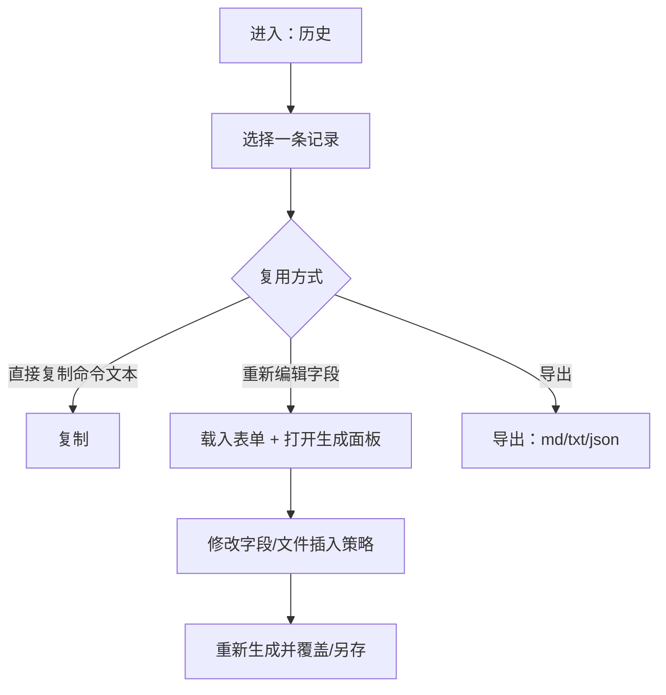

# 核心用户流程（User Flows）

> 目标：把“选命令 → 填字段 → 生成可粘贴文本 → 复用/导出”固化为低摩擦流程；在工作流模式下允许跳过，但要显式提示依赖缺失。

## Flow A：单命令生成（Single Command）

## Flow B：工作流分步（Workflow Stepper，可跳过）

## Flow C：复用历史（Runs / Drafts）

## Flow D：变量与依赖提示（Bindings）

- 变量来源：
  - 工作流步骤的“产物字段”（如 `PLAN_OUTPUT_PATH`）
  - 用户粘贴的 Claude Code 输出（手动注册为 `{{explore_output}}` 等）
- 当后续字段引用 `{{var}}` 缺失：
  - 预览中显示 `<<MISSING:var>>`
  - 在 Stepper 中显示“缺失依赖”的清单（可跳转到产生变量的步骤）

